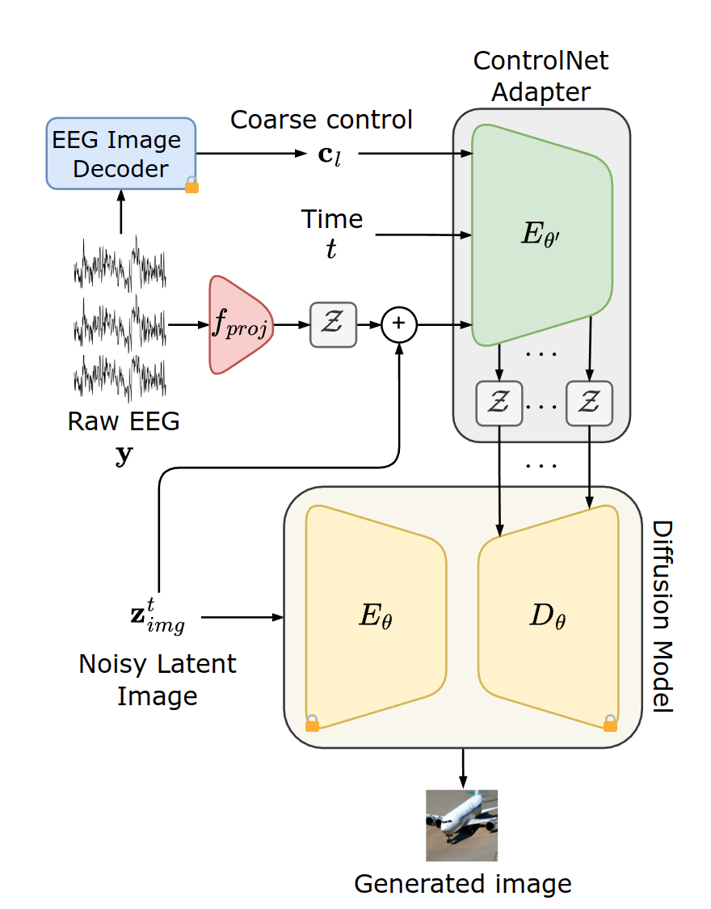

# GWIT


Official PyTorch repository for GWIT, Guess What I Think: Streamlined EEG-to-Image Generation with Latent Diffusion Models.
### Abstract :bookmark_tabs:
Generating images from brain waves is gaining increasing attention due to its potential to advance brain-computer interface (BCI) systems by understanding how brain signals encode visual cues. Most of the literature has focused on fMRI-to-Image tasks as fMRI is characterized by high spatial resolution. However, fMRI is an expensive neuroimaging modality and does not allow for real-time BCI. On the other hand, electroencephalography (EEG) is a low-cost, non-invasive, and portable neuroimaging technique, making it an attractive option for future real-time applications. Nevertheless, EEG presents inherent challenges due to its low spatial resolution and susceptibility to noise and artifacts, which makes generating images from EEG more difficult. In this paper, we address these problems with a streamlined framework based on the ControlNet adapter for conditioning a latent diffusion model (LDM) through EEG signals. We conduct experiments and ablation studies on popular benchmarks to demonstrate that the proposed method beats other state-of-the-art models. Unlike these methods, which often require extensive preprocessing, pretraining, different losses, and captioning models, our approach is efficient and straightforward, requiring only minimal preprocessing and a few components. 


[Paper](https://arxiv.org/abs/2410.02780) | [IEEE Paper]() |


[Eleonora Lopez](), [Luigi Sigillo](https://luigisigillo.github.io/), [Federica Colonnese](), [Massimo Panella](https://massimopanella.site.uniroma1.it/) and [Danilo Comminiello](https://danilocomminiello.site.uniroma1.it/home)

[ISPAMM Lab](https://ispamm.it/) and [NESYA Lab](https://sites.google.com/view/nesya) , Sapienza University of Rome 
### Model Architecture :clapper:


### Update
- **xx.xx.2025**: 
- **xx.xx.2024**: Checkpoints are released.
- **xx.xx.2024**: Repo is released.


### Demo

[]() 

For more evaluation, please refer to our [paper](https://arxiv.org/abs/2410.02780) for details.

### How to run experiments :computer:

### Running Examples

#### Train


#### Resume


#### Test directly
Request access to the pretrained models from [Google Drive]().


### Dataset

### Cite
Please cite our work if you found it useful:
```
@misc{lopez2024guessithinkstreamlined,
      title={Guess What I Think: Streamlined EEG-to-Image Generation with Latent Diffusion Models}, 
      author={Eleonora Lopez and Luigi Sigillo and Federica Colonnese and Massimo Panella and Danilo Comminiello},
      year={2024},
      eprint={2410.02780},
      archivePrefix={arXiv},
      primaryClass={cs.CV},
      url={https://arxiv.org/abs/2410.02780}, 
}
```


### Acknowledgement

This project is based on [diffusers](https://github.com/huggingface/diffusers). Thanks for their awesome work.
